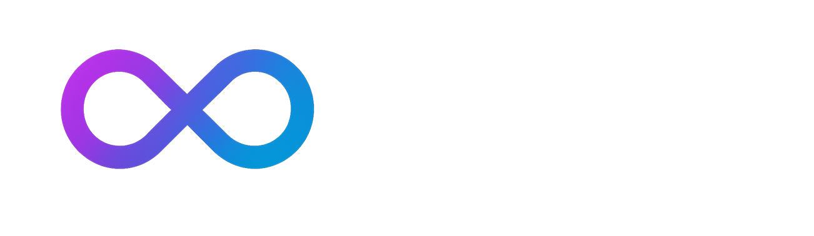
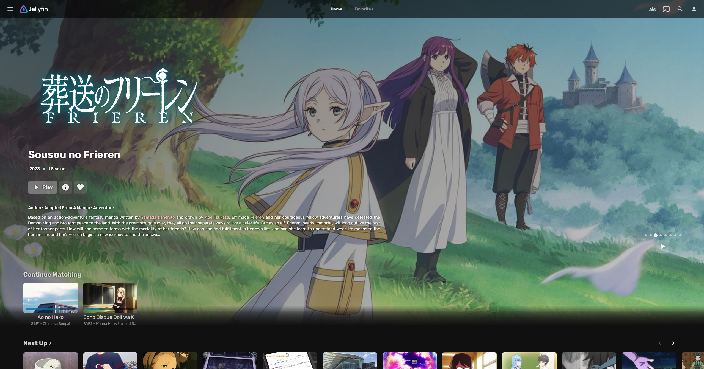
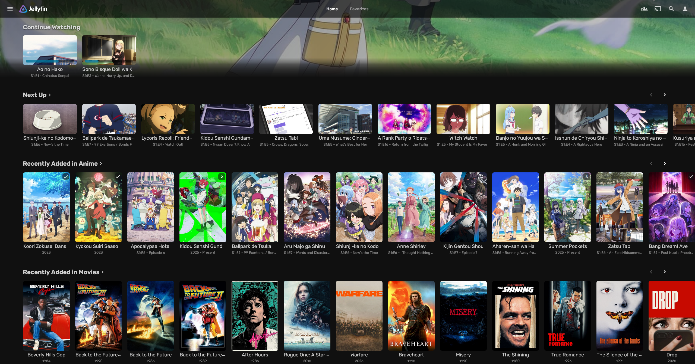
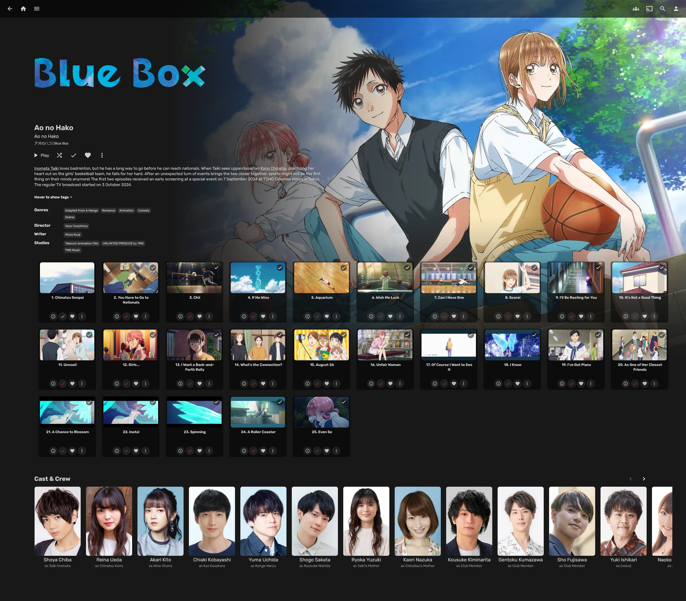
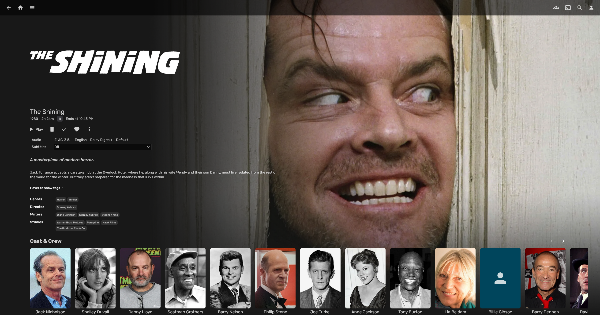

# Finity Theme for Jellyfin



Now in beta. There is still polishing to be done here and there, and some areas of the UI haven't been completely finalized yet, but most of the main styling is present. PRs are welcomed - whether it be to make things more efficient, performant, or to polish the overall theme. Right now there may be quite a few bugs since I haven't had very many people testing it on different browsers and monitor setups.

Finity is a modern, minimal, and elegant theme for [Jellyfin](https://jellyfin.org). Designed with clarity and immersiveness in mind, it introduces sleek typography, and a clean layout to elevate your media browsing experience.

> [!IMPORTANT]
> This theme is meant to be used in conjunction with Jellyfin's included "Dark" user theme (found in your user settings). **Using any other built-in Jellyfin theme is NOT supported at this time, and will almost certainly look terrible.**
>
> Music libraries are not supported at this time, and at the moment I have no immediate plans to work on this. However, I will gladly look at any PRs for music libraries.
> 
> Finally, make sure to **enable blurred placeholders for images** and **disable backdrops** in your user display settings. Not doing so may cause several important aspects of the theme to not render correctly (such as the gradient mask for show backdrops)

---

## Features

- Grid-style season view, aiming to somewhat emulate Plex's look
- Minimalist UI adjustments for improved readability and visual polish
- Customizable theme powered by CSS variables for colors, sizing, layout, and visibility
- Rubik font integration for sleek typography
- Hover effects, shadows, and lift transitions for a more dynamic, tactile feel
- Redesigned cards and buttons with rounded corners
- Collapsible, pill-styled tags

---

## Screenshots

<div align="center">







</div>


---

## Installation

There are two different variants available for you to choose from:
### 1. Complete
   Contains ALL features and is exactly as pictured in the preview screenshots. Contains some subjective tweaks and UI decisions.
   > [!IMPORTANT]
   > The "complete" variant of this theme relies on several external scripts, and an additional CSS ruleset. You **must** add some lines in your Jellyfin webroot's `index.html` file, **just before `</head>`**:
   ```
   <script src="https://cdn.jsdelivr.net/npm/marked@15.0.11/marked.min.js"></script><script src="https://cdn.jsdelivr.net/npm/dompurify@3.2.5/dist/purify.min.js"></script><script async src="https://cdn.jsdelivr.net/gh/prism2001/finity@main/clickableTitles.js"></script>     <link rel="stylesheet" href="https://cdn.jsdelivr.net/gh/prism2001/finity@main/complete/slideshowpure.css" />
   <script async src="https://cdn.jsdelivr.net/gh/prism2001/jellyfin-featured-slideshow@main/slideshowpure.js"></script>
   ```
   You can usually find the webroot in the following locations:
   
   Linux: `/usr/share/jellyfin/web/index.html`
   
   Windows: `C:\Program Files\Jellyfin\Server\jellyfin-web\index.html`

   Finally, in your webroot, create an `avatars` directory, and inside of it, a `list.txt` file. Then format it like this:

   ```
   Featured
   ID1
   ID2
   ID3
   ```

   Replace the `IDx` lines with an ID from a movie or show in your library. You can get this by clicking on something, and copying the `&id=` from your browser's URL bar:
   
   

   Ideally you would put 8 different IDs in this file, but if you download `slideshowpure.js`, copy it to your webroot and change the `src=` in `index.html` to point to your local copy, you can change the variables to your liking.


   ---
   
   After completing the steps above, add this to the **top** of your Jellyfin's custom CSS field:
   
   ``@import url("https://cdn.jsdelivr.net/gh/prism2001/finity@main/complete/finity-complete.css");
   ``

   If you're having issues with setting up the complete theme, see below:
<details>
  <summary>Common issues</summary>

  - **"I don't see the featured slideshow on the homepage!"**  
    Ensure you **carefully** copied the HTML from the block above correctly, and just before the `</head>` tag.

  - **"The featured slideshow is blank!"**  
    Make sure `/avatars/list.txt` exists in your Jellyfin web root.  
    For the slideshow to start displaying, there should be **at least one** media ID in the `list.txt` file.

  - **"The backdrop gradient isn't showing!"**  
    Make sure the user display settings mentioned at the top of the README are set properly.  
    Also, if you have any of your own custom CSS rules, ensure they aren't conflicting with the gradient mask.  
    Finally, make sure your browser is up to date. This theme does not support older browsers or clients.
</details>


   ---

### 2. Minimal

  <div align="center"></div>
  
   Reduced featureset with no external dependencies required. In the minimal theme, you lose these features:
   - No featured slideshow on homepage
   - No clickable episode titles in the season's grid view

   Add this to the **top** of your Jellyfin's custom CSS field:
   
   ``@import url("https://cdn.jsdelivr.net/gh/prism2001/finity@main/minimal/finity-minimal.css");``

---

## Customization

*(WIP, still a lot to fix here)* You can modify colors, roundness, blur, layout padding & spacing by copying the variables from the CSS file, or for more precise changes, manually importing and editing the CSS file manually. The CSS is organized to try to make customization relatively straightforward.

<details>
 <summary>Variables (paste in your custom CSS field)</summary>

 ```
/* ======================================== */
/* === CONFIGURABLE THEME VARIABLES (:root) === */
/* ======================================== */
:root {
  /* --- Base Colors --- */
  --theme-background-color: #181818; /* Base background for the page */
  --theme-background-color-alpha: #18181849; /* Background with alpha for some elements */
  --theme-text-color: #eee; /* Primary text color */
  --theme-text-color-secondary: #dbdbdb; /* Secondary text color (e.g., episode titles) */
  --theme-accent-color: #00a5dc; /* Main accent color (links, highlights) */
  --theme-accent-color-alpha-low: #000; /* Accent color with low alpha (hover effects) */
  --theme-accent-color-alpha-med: #00a5dc28; /* Accent color with medium alpha (hover effects) */
  --theme-accent-color-alpha-high: #00a5dc93; /* Accent color with high alpha (progress bar) */
  --theme-accent-color-alpha-hover: #01bfffed; /* Accent color on hover */
  --theme-warning-color: #bb4a4a; /* Color for warning/destructive actions (e.g., shutdown) */

  /* --- Alpha Colors (White & Black) --- */
  --theme-white-alpha-low: rgba(255, 255, 255, 0.08);
  --theme-white-alpha-med: rgba(255, 255, 255, 0.1);
  --theme-white-alpha-med-high: rgba(255, 255, 255, 0.15);
  --theme-white-alpha-high: rgba(255, 255, 255, 0.16);
  --theme-white-alpha-higher: rgba(255, 255, 255, 0.3);
  --theme-white-alpha-text-low: rgba(255, 255, 255, 0.7);
  --theme-white-alpha-text-med: rgba(255, 255, 255, 0.85);
  --theme-white-alpha-text-high: rgba(255, 255, 255, 0.9);
  --theme-black-alpha-low: rgba(0, 0, 0, 0.3);   /* Shadows */
  --theme-black-alpha-med: rgba(0, 0, 0, 0.55);  /* Progress bar bg, overlays */
  --theme-black-alpha-high: rgba(0, 0, 0, 0.6);  /* Context menu bg */
  --theme-black-alpha-higher: rgba(0, 0, 0, 0.8); /* Text shadows */
  --theme-black-alpha-highest: rgba(0, 0, 0, 0.85);/* Tooltips */

  /* --- Element Backgrounds --- */
  --card-bg: #101010; /* Background color for cards */
  --indicator-bg: #10101094; /* Background for indicators (played, count) */
  --transparent-bg: #10101000; /* Fully transparent background */
  --header-bg: rgba(0, 0, 0, 0.6); /* Background for header/action sheet */
  --button-bg: #2f2f2f; /* Background for standard buttons */
  --button-bg-subtle: rgba(255, 255, 255, 0.1); /* Subtle background for pill buttons, etc. */
  --button-bg-subtle-hover: rgba(255, 255, 255, 0.16); /* Hover background for subtle buttons */
  --button-bg-play: rgba(255, 255, 255, 0.3); /* Background for primary play buttons */
  --button-bg-overlay: rgba(255, 255, 255, 0.08); /* Background for small overlay buttons */
  --button-bg-overlay-hover: rgba(255, 255, 255, 0.15); /* Hover background for small overlay buttons */
  --tooltip-bg: rgba(0, 0, 0, 0.85); /* Background for tooltips */
  --context-menu-bg: rgba(58, 58, 58, 0.5); /* Fallback background for context menus (used with blur) */
  --sidebar-bg: rgba(0, 0, 0, 0.6); /* Background for collapsible sidebar */
  --episode-grid-bg: #00000082; /* Background for episode elements in the episode grid */

  /* --- Borders & Roundness --- */
  --theme-roundness: 0.5rem; /* General border radius */
  --theme-roundness-large: 15px; /* Larger border radius (e.g., cards) */
  --theme-roundness-xlarge: 1em; /* Extra large border radius (e.g., paper list) */
  --theme-roundness-full: 4em; /* Pill/fully rounded shape */
  --theme-roundness-progress: 10px; /* Border radius for progress bars */
  /* Border Gradient (Uncomment to use, ensure --border-color-solid is transparent) */
  /* --border-color: linear-gradient(45deg, rgba(255, 255, 255, 0.4) 0%, rgba(255, 255, 255, 0.1) 41%, rgba(255, 255, 255, 0.1) 57%, rgba(255, 255, 255, 0.3) 100%); */
  --border-color-solid: transparent; /* Use transparent for gradient border, or set a solid color */
  --border-width: 1px; /* Standard border width */
  --border-width-thick: 2px; /* Thicker border width */

  /* --- Effects --- */
  --blur-intensity: 2px; /* Blur amount */
  --blur-saturation: 180%; /* Saturation amount for blurred elements */
  --blur-effect: blur(var(--blur-intensity)) saturate(var(--blur-saturation)); /* Combined blur effect */
  --card-shadow: 0px 8px 16px var(--theme-black-alpha-low); /* Shadow for cards */
  --text-shadow-continue-watching: 0 1px 3px var(--theme-black-alpha-higher); /* Text shadow for 'Continue Watching' */
  --text-shadow-video-cue: /* Crunchyroll-style outline for subtitles */
    -3px -3px 0 black, -3px 0 0 black, -3px 3px 0 black,
    0 -3px 0 black, 0 3px 0 black,
    3px -3px 0 black, 3px 0 0 black, 3px 3px 0 black;

  /* --- Fonts & Text --- */
  --font-family-base: "Rubik", sans-serif; /* Primary font */
  --font-family-video-cue: 'Trebuchet MS', sans-serif; /* Font for video subtitles */
  --font-size-small: small;
  --font-size-base: 0.9rem; /* Base font size (e.g., episode titles) */
  --font-size-large: large;
  --font-size-h2: 1.5em; /* Default h2 size */
  --font-weight-normal: 400;
  --font-weight-semibold: 600;
  --font-weight-bold: 700;

  /* --- Layout & Sizing --- */
  --card-padding: 25px; /* Padding inside cards */
  --detail-page-side-padding: 5%; /* Padding on the sides of detail pages */
  --detail-page-primary-width: 45%; /* Width of the primary content area on desktop detail pages */
  --detail-page-backdrop-offset: 17%; /* Offset for the backdrop image */
  --detail-page-backdrop-width: 85vw; /* Width of the backdrop container */
  --detail-page-mask-offset: 16%; /* Start mask slightly before backdrop */
  --detail-page-mask-width: 85vw; /* Make mask slightly wider than backdrop */
  --detail-page-content-offset: -65vh; /* Vertical offset for content */
  --overflow-card-margin-left: 0vw; /* Left margin for the first overflow card */
  --overflow-portrait-width: 7.5vw; /* Width for portrait overflow cards */
  --overflow-backdrop-width: 8.5vw; /* Width for backdrop overflow cards */
  --episode-grid-gap: 1.5rem; /* Gap between items in the episode grid */
  --episode-grid-padding: 1rem; /* Padding around the episode grid */
  --episode-grid-min-item-width: 200px; /* Minimum width for episode grid items */
  --button-icon-only-size: 3.125rem; /* Size (width/height) for icon-only buttons */
  --button-play-padding: 0.5rem 1rem; /* Padding for the play button */
  --button-overlay-size: 26px; /* Size for small overlay buttons */
  --button-overlay-icon-size: 16px; /* Icon size within small overlay buttons */
  --button-episode-action-size: 32px; /* Size for episode action buttons */
  --button-episode-action-icon-size: 18px; /* Icon size for episode action buttons */
  --track-selection-max-width: 20vw; /* Max width for track selection popup */
  --track-selection-min-width: 160px; /* Min width for track selection popup */

  /* --- Toggles (Control display of certain elements) --- */
  /* Set to 'none' to hide, or an appropriate display value (block, flex, inline-block) to show */
  --display-header-warning: none;
  --display-original-title: block;
  --display-external-links: none;
  --display-tomato-rating: none;
  --display-age-rating: none;
  --display-imdb-logo: none;
  --display-star-rating: none;
  --display-critic-rating: none;
  --display-movie-trailer-tab: none;
}
```
</details>

---

## Compatibility

- Tested with Jellyfin 10.10.7 and later
- At the moment, primarily designed for desktop/web. Works on mobile devices, but a few things will look different - mobile needs some more work
- Not guaranteed to be compatible with unofficial forks or third-party clients
- **Not supported** on older browsers or Jellyfin versions. If you are using out-of-date software, I will not provide support for you.

---

## Special Thanks

MakD's [Jellyfin-Media-Bar](https://github.com/MakD/Jellyfin-Media-Bar) inspired me to start making this theme, as I wanted my own styling to go with it. Additionally, some design choices are borrowed from [Jamfin](https://github.com/JamsRepos/Jamfin) and [Glassmorphism](https://github.com/alexyle/jellyfin-theme).

## License

GPLv3

---

## Feedback and Contributions

Feel free to open an issue or pull request if you encounter a bug or want to contribute improvements.

---
